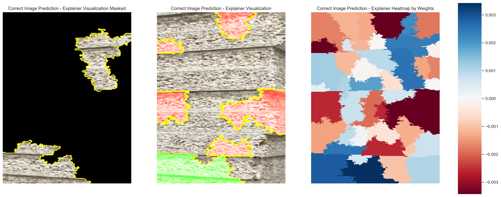
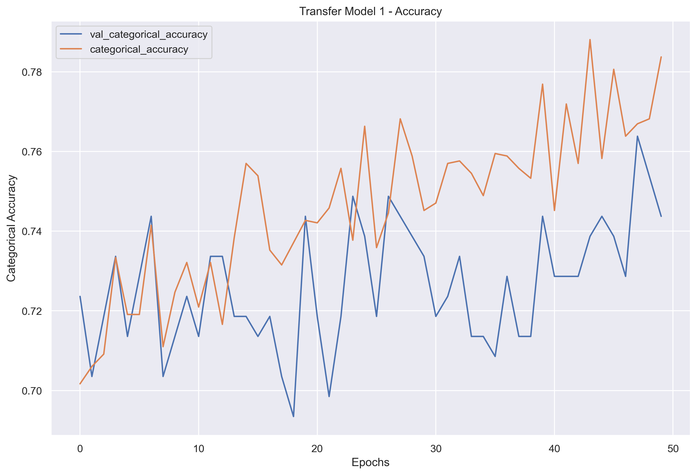
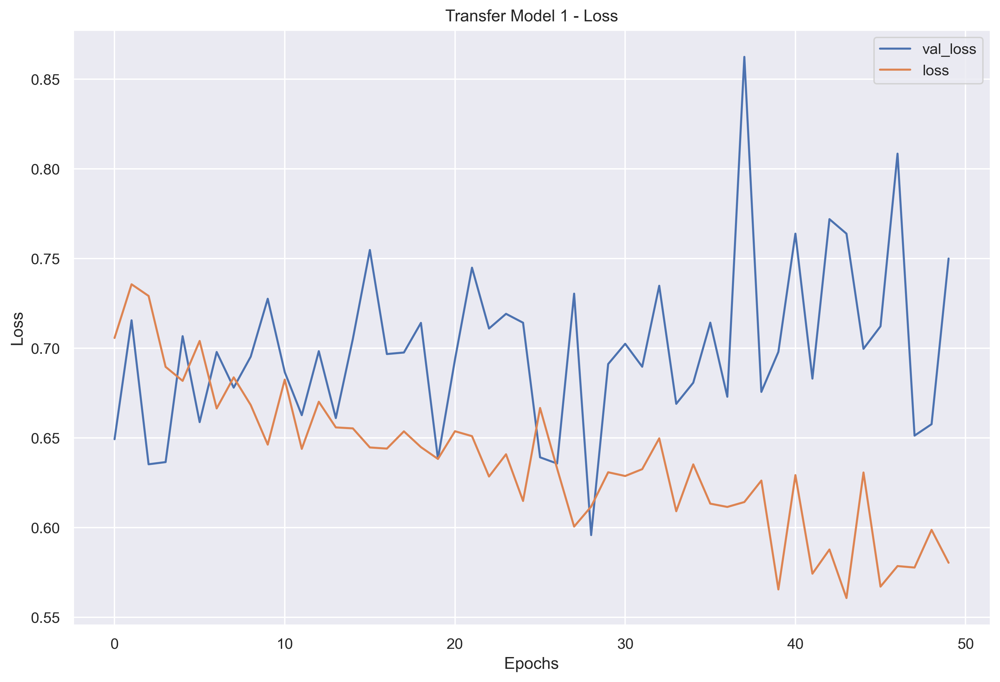
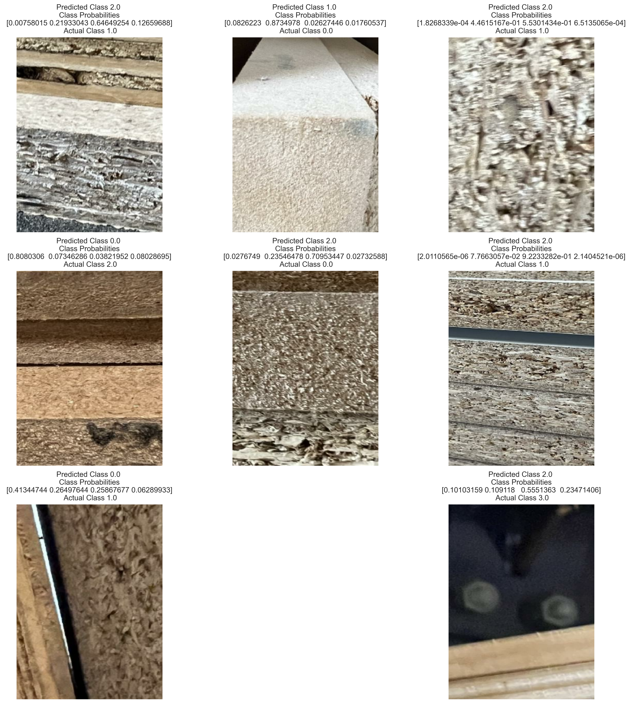

# Material Identification using CNN Image Classification

***

Tim Fuger

## Acknowledgements

I would like to give credit to Madjek, Inc. in Amityville, NY who provided the facilities for data collection and helped to advise in the business case scenario for this project. Although this scenario is a fictitious one, they were still happy to serve as an example for this data investigation, and we thank them for their support.

## Business Problem

To develop a Convolutional Neural Network that can properly identify material types for warehouse and scrap material handling.

## Project Overview

Our client Madjek, Inc. is a store fixture manufacturer who purchases a variety of sheet good materials for different jobs. They would like to install a material handling system which would keep track of their sheet good products in their warehouse. For the installation of this system, they would also like to eliminate barcodes and barcode scanners that would typically be used to track materials, so as to reduce the amount of employees required for material handling, as well as reduce human error in handling. In order to do this, they will need to have a system in place (using cameras and scanners) which would automatically recognize the type of material in a given situation. The system would need to recognize the material at certain intervals in material handling:

- When the material is offloaded from a truck and placed into the warehouse
- When the material is cut on the panel saw and then stored in with scrap cuts in the scrap racks
- To serve as a quality control check at the CNC routers to confirm the correct material has been placed on the machine

The company has 4 main types of materials that they work with that they would like to have classified:

- MDF
- TFL / Particle Core with HPL
- Particle Core
- Veneer Core

## Defining Metrics

Ultimately our client would like the model to be as accurate as possible. They are looking for an accuracy rating that falls within six sigma standards, which ideally refers to a 99.999997% accuracy. This computer vision system that is planned to be implemented is intended to be integrated into an automated material and inventory handling system, so any time a material is identified incorrectly, the system has the strong possibility of cutting the incorrect material and sending these incorrect parts out for production. Given this, there is no preference on whether the material identified is a false positive or a false negative, only that the predictions cannot be inaccurate.

The client also understands that achieving this ultimate goal will take iterations of the system in order to achieve the six sigma goal they are looking for. So for the first iteration of the system they intend to have workers at each identification interval to check the system for the first 90 days in production. Therefore, the first iteration of the computer vision network does not have to meet the six sigma goal but must attempt to get closer to that goal. We have agreed with the client to set a 70% accuracy rating goal for this iteration.

## Data

The images in this dataset contains around 2000 images that were taken at varying view points in both the warehouse and the scrap racks: 

All images were taken on a Iphone 13 pro camera. Across the range of images, there are a variety of lighting conditions, as well as a variety of close up and far away images. The far away images were taken within the warehouse, and are used to identify an entire stack of material, where the material will be the same for the entire stack. The close up images vary for both the warehouse and the scrap racks, where the piece of material that is centered in the image is what is identified as the material type. All original images in the dataset are located in images/0_Madjek_NoClass. There are other folders in images which were part of preprocessing, please see the first section of Preprocessing for more information on these folders.

There is also a Data_image_target csv file, which contains a column for the image file name, and a column for the material type of the image.

## Data Preprocessing

The images were originally distributed as follows:

We ran two different baseline models, so as to compare the differences in data preprocessing. The first baseline model was run on the original images. The second baseline model was run on the cropped images. We chose to move forward with the second baseline model as it provided more consistent results.

## Modeling

We started by created a CNN with data augmentation and droput included in the model, so as to stabilize the validation loss and accuracy loss divergence that was occuring in the baseline models. The next step was to fine tune and refit the model to attempt to improve performance metrics.

We then attempted to run transfer learning from Resnet50 on the same classification problem in order to improve results. 

After determining our final model, we then explored the model's feature maps to determine what aspects of the images were the most prevalent in determining the prediction decisions.

## Feature Importances

Using the Lime package, we were able to identify areas in the image where the model found the most important in making its prediction. Both for correct and incorrect image predictions.

And by the look of the images, the inconsistency of images will lead to incorrect predictions in the dataset.

## Results

With callbacks integrated into the final model, the model seems to stop prior to the 50 epochs set, and converges at about 68% accuracy for the model.

So we just misssed the required criteria for this exercise. But we were extremely close to where we needed to be for this initial iteration of this image classifier. We only missed our initial goal of 70% by a few percentage points. Most of this error in the model was the model confusing TFL and PC sheets, which is understandably difficult given the similar core material. We were able to confirm this suspicion by looking at the probabilities across the board for a sample of incorrect images.

Our final confusion matrix and classification report confirm this as well.

## Recommendations

Each working interval should a similar hardware setup in order to take consistent images. It is clear from the incorrectly predicted data that a dedicated area with a mounted camera and a standard lighting strategy is paramount. In order to prevent incorrect predictions, the following takeaways are:

- All images must have no background in them at all.

- There should be no other material in the image frame.

- The area located in the frame of the image should be blown off with compressed air to clean off any dust that might be on the material

- Images should always be taken from the same distance away from material

Here are actionable recommendations for each of the three areas based on our data collection as well as data analysis from this notebook. For each working area at Madjek, a 3d model of the setup was created to clearly show the proposed design of each area:

#### 1. Warehouse for incoming skids for material

a. Section off a 5' x 10' area with a rectangle of floor tape and indicate where a 4' wide stack and 5' wide stack should be placed with a line on the floor, in order to center those stacks with the camera. 

b. Place a mounted camera on a tripod locked to the ground to capture images of the short side of the material stack.

b. On the same side as the camera, warm even light (from ideally two light sources each on either side of the camera) should be pointed at the short side of the material stack.

c. The camera should be mounted as close to the material as possible while also being out of the working area so as to not be hit by people or material. In this case, the optimal positioning is 3'-6" away and 11" high so that it can capture both full stacks and partial stacks of incoming material.

d. On the opposite side of the camera, place a blank backdrop (a blank solid colored wall) to prevent noise in images should the camera be taking picutres of partial stacks of received material.

Camera frame at Warehouse:

Camera Setup at Warehouse:

Top view Drawing:

#### 2. Panel saw for scrap parts

a. A standing height work surface should be setup close to the panel saw to accept scrap cuts that vary up to 5' in width and 10' in length. This work surface should be painted or laminated in one solid color.

b. The camera should be mounted as close to the material as possible while also being out of the working area so as to not be hit by people or material. A camera should be hung from the ceiling at about 7 ft high and 9 ft away diagonally to capture the corner of the material.

c. Two light sources should be hung next to the camera pointed at the material to disperse warm even light on the material.

Camera frame at Panel Saw:

Camera Setup at Panel Saw:

Top View Drawing:

#### 3. CNC router to confirm the material on the machine prior to cutting

a. The camera should be mounted as close to the material as possible while also being out of the working area so as to not be hit by people or material. Hang mounted camera about 9 ft diagonally from corner of material and 7' in the air, pointed towards material corner at the origin on router when the router is homed.

b. Any other surfaces in the camera frame should be painted or laminated a solid black color to prevent noise.

c. Two light sources should be hung next ot he camera pointed at the material to disperse warm even light on the material.

Camera frame at CNC router:

Camera Setup at CNC router:

Top View Drawing:

#### Model Implementation
- The final model from above can be implemented immediately with human assistance. At each working interval the model can automatically make a prediction and store that prediction in the memory of the material handling system at each workstation. The moment that prediction is made, it should also appear on a tablet for the dedicated worker at that workstation. The worker can then check the prediction to the actual material. In 7 out of 10 times, the model will be right. For each time it is wrong though, the worker should be able to press the correct material on the tablet in order to inform the algorithm, that way it can train to become more accurate over time. This period of human oversight should take place for 90 days after implementation. During this time, all points in the "next steps" category should be completed. After this 90 day period, the model will be assessed again for its rate of accuracy, and next steps will be determined pending the outcomes of the assessment.

## Next Steps

Further analysis could yield additional insight such as:
- Increase the amount of data that the algorithm trains on. While 2,000 images is a good start, 10,000 or 20,000 would be even better for improving the performance of the model.
- For the warehouse area, it would be better to explore having the camera take a picture of the incoming product label and creating a separate algorithm to parse that information.
- Additional fine tuning of the transfer model would be required in order to cope with new image conditions. Better results could be obtained by testing the final model through additional iterations as well.

## Repository Navigation

In this repository you will find the following files to take note of:

[Notebook](Notebook.ipynb) contains the main data analysis code and notes for this project.

[Crop Images](Image Preprocessing Notebooks/Crop_Images.ipynb) contains code to take all original images from a directory, crop them by a percentage of the original size, and paste in a newly created directory.

[Train-Split-Multiclass-Images](Image Preprocessing Notebooks/Train-Split-Multiclass-Images.ipynb) contains code which uses a csv file to save images in a new directory according to their classes. The second half of the code will further take the images in this newly created directory, and split them into folders for train, validation, and test sets of data.

[images](images) folder contains all the images used for the dataset.

[Data Image Target](Data_Image_Target.csv) contains all the image file names, and the material identified. This file was created by having a human go through each image and label them accordingly in this csv file.

[Visualizations](Visualizations) folder contains all the visualizations such as renderings, drawings, plots and graphs.

[Logs](logs) folder contains all the Tensorboard logs for neural networks that have been run throughtout tworking on this project.

[Material-Identification](Presentation/Material-Identification.pptx) powerpoint presentation.

[Material Identification](Presentation/Material-Identification.pdf) pdf file of presentation.

For additional info, contact Tim Fuger at tfuger10@gmail.com