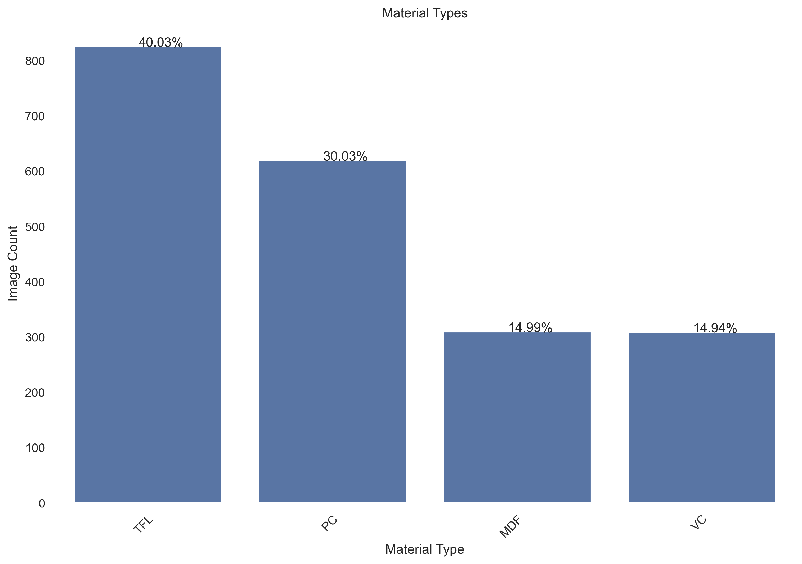
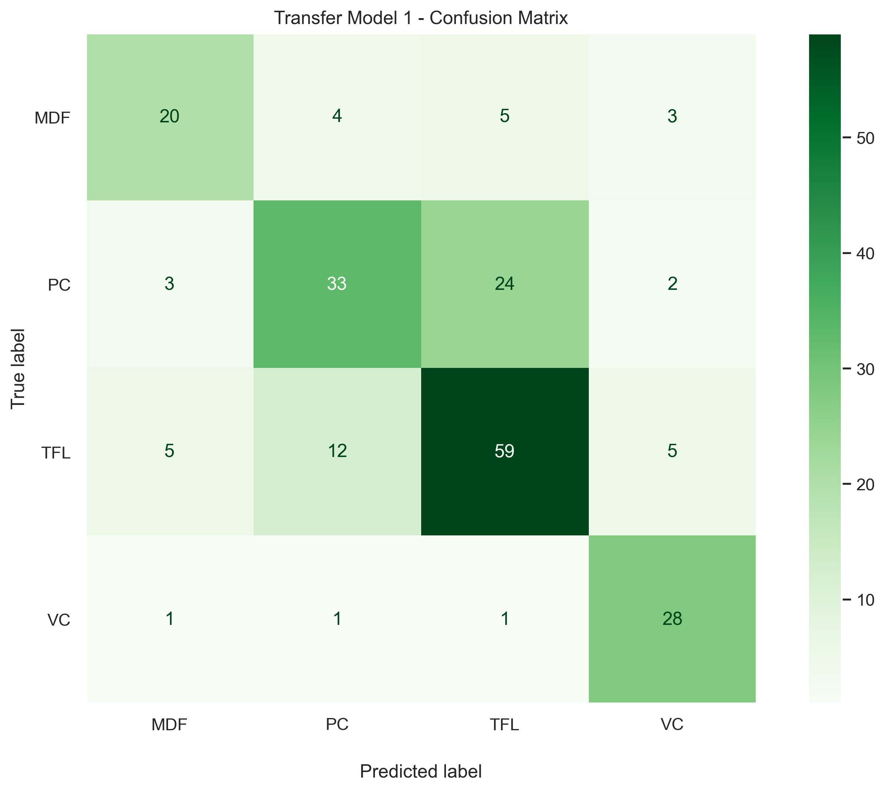
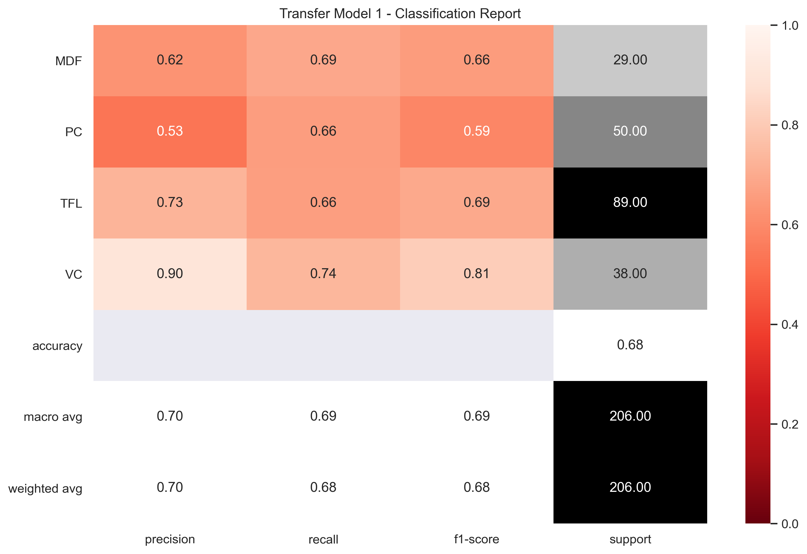

# Material Identification using CNN Image Classification
***
Tim Fuger

## Acknowledgements

I would like to give credit to Madjek, Inc. in Amityville, NY who provided the facilities for data collection and helped to advise in the business case scenario for this project. Although this scenario is a fictitious one, they were still happy to serve as an example for this data investigation, and we thank them for their support.

## Business Problem

To develop a Covolutional Nueral Network that can properly identify material types for warehouse and scrap material handling.

## Project Overview

Our client Madjek, Inc. is a store fixture manufacturer who purchases a variety of sheet good materials for different jobs. They would like to install a material handling system which would keep track of their sheet good products in their warehouse. For the installation of this system, they would also like to eliminate barcodes and barcode scanners that would typically be used to track materials, so as to reduce the amount of employees required for material handling, as well as reduce human error in handling. In order to do this, they will need to have a system in place (using cameras and scanners) which would automatically recognize the type of material in a given situation. The system would need to recognize the material at certain intervals in material handling:

- When the material is offloaded from a truck and placed into the warehouse
- When the material is cut on the panel saw and then stored in with scrap cuts in the scrap racks
- To serve as a quality control check at the CNC routers to confirm the correct material has been placed on the machine

The company has 4 main types of materials that they work with that they would like to have classified:

- MDF
- TFL / Particle Core with HPL
- Particle Core
- Veneer Core

## Defining Metrics

Ultimately our client would like the model to be as accurate as possible. They are looking for an accuracy rating that falls within six sigma standards, which ideally refers to a 99.999997% accuracy. This computer vision system that is planned to be implemented is intended to be integrated into an automated material and inventory handling system, so any time a material is identified incorrectly, the system has the strong possibility of cutting the incorrect material and sending these incorrect parts out for production. Given this, there is no preference on whether the material identified is a false positive or a false negative, only that the predictions cannot be inaccurate.

The client also understands that achieving this ultimate goal will take iterations of the system in order to achieve the six sigma goal they are looking for. So for the first iteration of the system they intend to have workers at each identification interval to check the system for the first 90 days in production. Therefore, the first iteration of the computer vision network does not have to meet the six sigma goal but must attempt to get closer to that goal. We have agreed with the client to set a 70% accuracy rating goal for this iteration.

## Data

The images in this dataset contains around 2000 images that were taken at varying view points in both the warehouse and the scrap racks: 

All images were taken on a Iphone 13 pro camera. Across the range of images, there are a variety of lighting conditions, as well as a variety of close up and far away images. The far away images were taken within the warehouse, and are used to identify an entire stack of material, where the material will be the same for the entire stack. The close up images vary for both the warehouse and the scrap racks, where the piece of material that is centered in the image is what is identified as the material type. All original images in the dataset are located in images/0_Madjek_NoClass. There are other folders in images which were part of preprocessing, please see the first section of Preprocessing for more information on these folders.

There is also a Data_image_target csv file, which contains a column for the image file name, and a column for the material type of the image.

## Data Preprocessing

The images were originally distributed as follows:

We ran two different baseline models, so as to compare the differences in data preprocessing. The first baseline model was run on the original images. The second baseline model was run on the cropped images. We chose to move forward with the second baseline model as it provided more consistent results.

## Modeling

We started by created a CNN with data augmentation and droput included in the model, so as to stabilize the validation loss and accuracy loss divergence that was occuring in the baseline models. The next step was to fine tune and refit the model to attempt to improve performance metrics.

We then attempted to run transfer learning from Resnet50 on the same classification problem in order to improve results. 

After determining our final model, we then explored the model's feature maps to determine what aspects of the images were the most prevalent in determining the prediction decisions.

## Feature Importances

Using the Lime package, we were able to identify areas in the image where the model found the most important in making its prediction. 

## Results

With callbacks integrated into the final model, the model seems to stop prior to the 50 epochs set, and converges at about 68% accuracy for the model.

So we just misssed the required criteria for this exercise. But we were extremely close to where we needed to be for this initial iteration of this image classifier. We only missed our initial goal of 70% by a few percentage points. Most of this error was in the model confusing TFL and PC sheets, which is understandably difficult given the similar core material.

## Next Steps

Next steps beyond this investigation would be to:

- Collect data again with additional time to create a more consistent method for obtaining quality data that is at the same distance from the object, and in the same lighting conditions. This setup would have to be engineered for each interval in the working process where an image must be taken.
- Increase the amount of data that the algorithm trains on. While 2,000 images is a good start, 10,000 or 20,000 would be even better for improving the performance of the model.
- Each working interval should a similar hardware setup in order to take consistent images at each interval. A dedicated area with a mounted camera and a lighting strategy should exist in (1) the warehouse for incoming skids for material, (2) at the panel saw for scrap parts, and (3) at each CNC router to confirm the material on the machine prior to cutting.
- After a recollection of data, additional fine tuning of the transfer learning model would be required in order to cope with the new conditions.
- We tried a number of different models in the notebook above, but better results could be obtained by testing the final model through additional iterations.

## Repository Navigation

In this repository you will find the following files to take note of:

[Notebook](Notebook.ipynb) contains the main source code for this project.

[Crop Images](Crop_Images.ipynb) contains code to take all original images from a directory, crop them by a percentage of the original size, and paste in a newly created directory.

[Train-Split-Multiclass-Images](Train-Split-Multiclass-Images.ipynb) contains code which uses a csv file to save images in a new directory according to their classes. The second half of the code will further take the images in this newly created directory, and split them into folders for train, validation, and test sets of data.

[images](images) folder contains all the images used for the dataset.

[Material-Identification](Material-Identification.pptx) powerpoint presentation.

[Material Identification](Material-Identification.pdf) pdf file of presentation.

For additional info, contact Tim Fuger at tfuger10@gmail.com